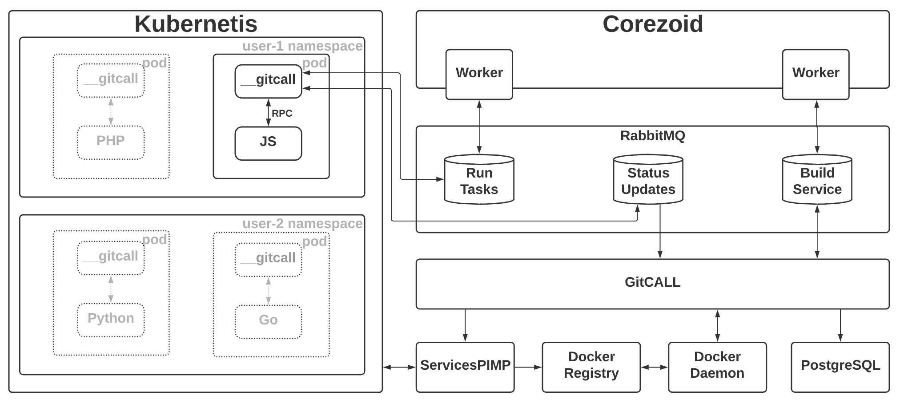
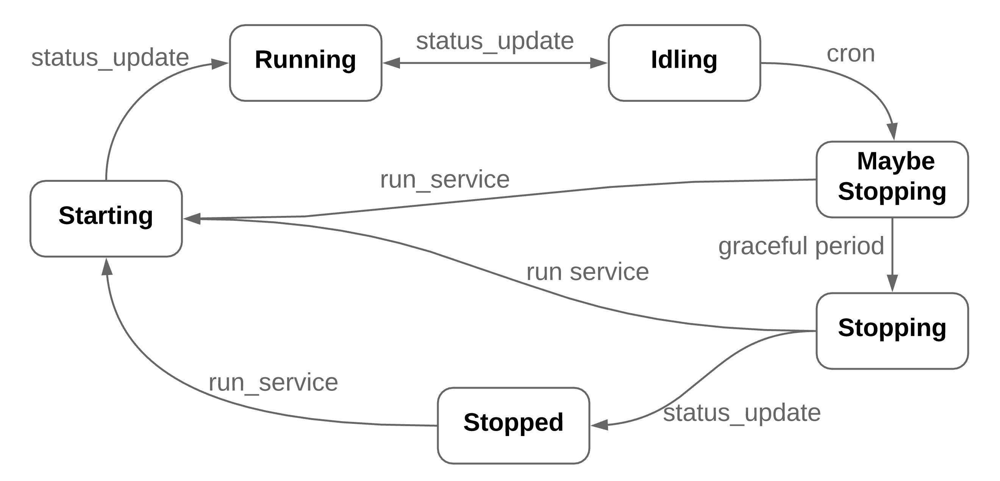

# GitCallv2 


### Requirements
- Metric-server, prometheus and calico are required

### cz-tool 
- ```curl -sSfL --output cz "https://repo.middleware.biz/deps/cz/darwin/amd64/1.3.0/cz"```
- ```chmod +x cz```

### Installation notes:
- list available versions 
  ```cz release list-available```
- make new release 
  ```cz release new gitcall/2.0.2 gitcall --vv```
- fill in release.yaml similar to example/release.yaml (based on default corezoid config)
- test config ```cz valid``` (WARN docker-registry: helm schema: not found  - its ok)
- Deploy - ```cz deploy --vv```
- if redeploy does not go through - try again using ```cz helm uninstall```
# Gitcall

The service manages custom client services and dundergitcall services. It can build images and run them in k8s namespace.

Structure:


Statuses:
  
